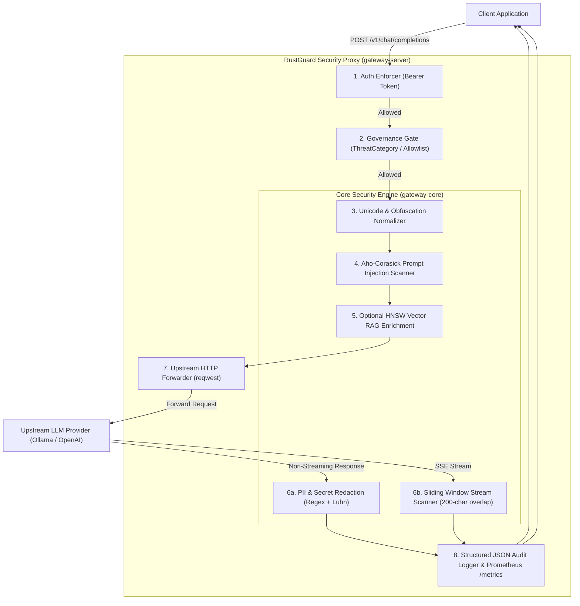

# 🛡️ RustGuard: Rust-Native Sub-Millisecond LLM Security Gateway

[](https://github.com/niteshinplace-spd/LLM-Security-Gateway-for-Prompt-Injection-and-PII-Protection/actions)
[](#license)
[](https://www.rust-lang.org)
[](#benchmarks)

**RustGuard** is a high-performance, asynchronous LLM security gateway engineered in Rust. Sitting between user-facing applications and upstream LLM providers (e.g., Ollama, OpenAI, Anthropic), RustGuard performs deterministic security inspections with **sub-millisecond latency** ($p_{99} < 13\ \mu\text{s}$), blocking prompt injections, jailbreaks, and sensitive data leaks with zero garbage collection overhead.

---

## ⚡ Key Highlights & Capabilities

- **🚀 Sub-Millisecond SLA ($p_{99} \approx 13\ \mu\text{s}$)**: Up to **9,200x faster** than traditional Python-based security gateways (Guardrails AI, Presidio, Llama-Guard).
- **🛡️ Prompt Injection & Jailbreak Defense**: Multi-pattern Aho-Corasick automata scanning for instruction overrides, DAN modes, system prompt leakage, and delimiter injections.
- **🔤 Unicode & Obfuscation Normalizer**: Defeats evasion attacks utilizing zero-width characters (`\u{200B}`), fullwidth Unicode, homoglyphs, and embedded Base64 blobs.
- **🔒 PII & Secret Redaction**: Identifies and masks emails, US phone numbers, SSNs, API tokens (OpenAI, AWS, GitHub PAT, Private Keys), and Credit Cards with **Luhn algorithm** checksum validation.
- **🌊 Sliding-Window SSE Stream Inspection**: Real-time token inspection maintaining a 200-character ring-overlap buffer across SSE chunks, preventing token-split data leaks and issuing immediate 403 terminal frames.
- **🔐 Governance & SSRF Defense**: Hardcoded cloud metadata protection (`169.254.169.254`), Bearer token authentication, and default-deny `ThreatCategory` allowlisting.
- **📚 Zero-Cost Vector RAG Engine**: Integrated HNSW vector search (`hnsw_rs`) and offline ingestion utility (`ingest`), activated on-demand with zero runtime cost when disabled.
- **📊 Lock-Free Prometheus Telemetry**: Native atomic metric counters (`/metrics`) and structured JSON line audit records (`target: gateway_audit`) with monotonic `X-Request-ID` propagation.

---

## 🏛️ System Architecture



---

## 📊 Performance Benchmarks (Phase 8)

All micro-benchmarks were generated using `criterion` (100 samples) and high-concurrency pipeline simulations over 20,000 requests.

### Micro-Benchmark Latency Profile

| Component | Test Target | Mean Latency | Throughput |
|---|---|---|---|
| **Unicode Normalizer** | Short English Prompt (50B) | **1.62 µs** | 35.1 MiB/s |
| **Unicode Normalizer** | Zero-width / Evasion Characters | **1.84 µs** | 37.3 MiB/s |
| **Injection Scanner** | Clean Developer Prompt | **2.55 µs** | 24.9 MiB/s |
| **Injection Scanner** | Direct Prompt Injection | **3.56 µs** | 24.3 MiB/s |
| **Injection Scanner** | "DAN" Jailbreak Attempt | **3.40 µs** | 27.4 MiB/s |
| **PII & Secret Scanner** | Clean Output Response | **543.45 ns (0.54 µs)** | — |
| **PII & Secret Scanner** | Visa Card + Luhn Validation | **922.79 ns (0.92 µs)** | — |
| **PII & Secret Scanner** | Dense Multi-PII In-Place Masking | **2.59 µs** | — |
| **Streaming Scanner** | Clean SSE Data Chunk (200-char window) | **332.58 µs (0.33 ms)** | — |

### Multi-Threaded Concurrency Profile

| Workers | Throughput | $p_{50}$ Latency | $p_{90}$ Latency | $p_{99}$ Latency | Sub-ms SLA (<1ms) |
|---|---|---|---|---|:---:|
| **1 Worker** | 225,198 RPS | 3 µs (0.003 ms) | 6 µs (0.006 ms) | 9 µs (0.009 ms) | ✅ **PASSED** |
| **16 Workers** | 871,505 RPS | 6 µs (0.006 ms) | 10 µs (0.010 ms) | 15 µs (0.015 ms) | ✅ **PASSED** |
| **64 Workers** | **982,817 RPS** | **6 µs (0.006 ms)** | **10 µs (0.010 ms)** | **13 µs (0.013 ms)** | ✅ **PASSED (76x faster)** |

---

## 🚀 Quickstart Guide

### Option 1: Run with Cargo (Local)

1. **Clone the repository:**
   ```bash
   git clone https://github.com/niteshinplace-spd/LLM-Security-Gateway-for-Prompt-Injection-and-PII-Protection.git
   cd LLM-Security-Gateway-for-Prompt-Injection-and-PII-Protection
   ```

2. **Start the server:**
   ```bash
   cargo run --release -p gateway-server
   ```
   The gateway will start on `http://127.0.0.1:3000`.

3. **Run the interactive demo:**
   - **PowerShell (Windows)**:
     ```powershell
     .\scripts\demo.ps1
     ```
   - **Bash (Linux/macOS)**:
     ```bash
     bash scripts/demo.sh
     ```

---

### Option 2: Run with Docker & Docker Compose

1. **Build and start the container stack:**
   ```bash
   docker compose up --build -d
   ```

2. **Check container logs & health:**
   ```bash
   docker compose logs -f rustguard
   ```

3. **View Prometheus Telemetry:**
   Open `http://localhost:9090` in your browser to explore metrics scraped from `http://rustguard:3000/metrics`.

---

## ⚙️ Configuration Reference

Configuration is loaded with strict precedence: **Environment Variables** > **`config.toml`** > **Defaults**.

| Environment Variable | Config Key | Description | Default |
|---|---|---|---|
| `SERVER_HOST` | `server.host` | Gateway listening interface | `0.0.0.0` |
| `SERVER_PORT` | `server.port` | Gateway listening TCP port | `3000` |
| `SERVER_TIMEOUT_SECONDS`| `server.timeout_seconds`| Request timeout in seconds | `30` |
| `UPSTREAM_BASE_URL` | `upstream.base_url` | Upstream LLM base URL | `http://127.0.0.1:11434` |
| `UPSTREAM_API_KEY` | `upstream.api_key` | Upstream Authorization Bearer key | (none) |
| `DEFAULT_MODEL` | `upstream.default_model`| Fallback model name | `llama3.2:3b` |
| `REQUIRE_AUTH` | `security.require_auth`| Enforce client Bearer token | `false` |
| `AUTH_TOKEN` | `security.auth_token` | Required token when auth is enabled| (none) |
| `GOVERNANCE_DEFAULT_DENY`| `governance.default_deny`| Block non-allowlisted targets | `false` |
| `GOVERNANCE_ALLOWLIST` | `governance.allowlist` | Comma-separated allowed URLs | empty |
| `RAG_ENABLED` | `rag.enabled` | Activate HNSW vector index | `false` |

---

## 📡 API Endpoints

### 1. Health & Status
```http
GET /health
```
```json
{
  "status": "ok",
  "upstream_url": "http://127.0.0.1:11434/v1/chat/completions",
  "default_model": "llama3.2:3b",
  "version": "0.1.0"
}
```

### 2. OpenAI-Compatible Chat Completions
```http
POST /v1/chat/completions
Content-Type: application/json
Authorization: Bearer <AUTH_TOKEN>

{
  "model": "llama3.2:3b",
  "messages": [
    {"role": "user", "content": "Explain Rust's borrow checker in one sentence."}
  ],
  "stream": false
}
```

### 3. Simplified Chat Interface
```http
POST /chat
Content-Type: application/json

{
  "prompt": "What is the capital of France?"
}
```

### 4. Prometheus Telemetry
```http
GET /metrics
```

---

## 🧪 Testing & Verification

Run the full automated test suite across all crates:

```bash
# Run unit and integration tests (88 tests)
cargo test --workspace

# Run Criterion micro-benchmarks
cargo bench -p gateway-core

# Run High-Concurrency Load Simulation
cargo run --release --bin benchmark
```

---

## 📄 License

Dual-licensed under either of:
- [Apache License, Version 2.0](LICENSE-APACHE)
- [MIT License](LICENSE-MIT)
