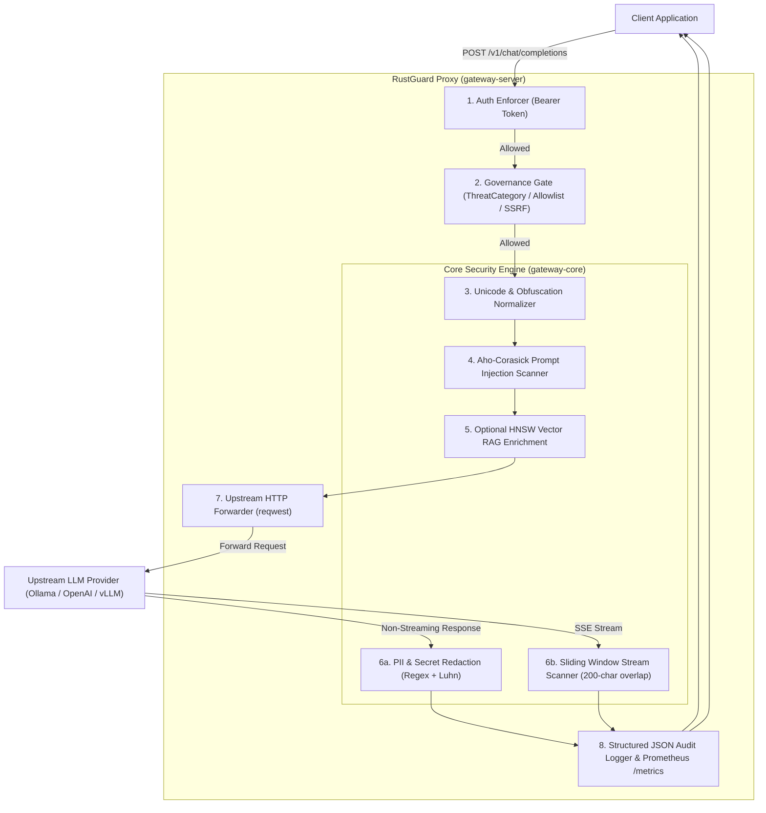

# 🛡️ RustGuard: Rust-Native Sub-Millisecond LLM Security Gateway

[](https://github.com/niteshinplace-spd/LLM-Security-Gateway-for-Prompt-Injection-and-PII-Protection/actions)
[](#license)
[](https://www.rust-lang.org)
[](#-performance-benchmarks)
[](#-testing--test-coverage)

**RustGuard** is a high-performance, memory-safe, and asynchronous LLM security gateway engineered in Rust. Sitting as a reverse proxy between client applications and upstream LLM providers (e.g., Ollama, OpenAI, Anthropic, vLLM), RustGuard inspects incoming prompts and outgoing model responses in real time with **sub-millisecond latency** ($p_{99} < 13\ \mu\text{s}$), blocking prompt injections, jailbreaks, and sensitive data leaks with zero garbage collection pauses.

---

## 📑 Table of Contents
1. [⚡ Key Capabilities](#-key-capabilities)
2. [🏛️ System Architecture](#️-system-architecture)
3. [📂 Workspace Structure](#-workspace-structure)
4. [📊 Performance Benchmarks](#-performance-benchmarks)
5. [🚀 Quickstart Guide](#-quickstart-guide)
   - [Option 1: Local Cargo Run](#option-1-local-cargo-run)
   - [Option 2: Docker & Docker Compose](#option-2-docker--docker-compose)
6. [🎬 Interactive Live Demo](#-interactive-live-demo)
7. [⚙️ Configuration Reference](#️-configuration-reference)
8. [📡 API Endpoints & Request Flow](#-api-endpoints--request-flow)
9. [🧪 Testing & Test Coverage](#-testing--test-coverage)
10. [📄 License](#-license)

---

## ⚡ Key Capabilities

- **🚀 Microsecond Execution ($p_{99} \approx 13\ \mu\text{s}$)**: Operates **5,800x faster at $p_{50}$** and **9,200x faster at $p_{99}$** than Python-based security gateways (Guardrails AI, Presidio, Llama-Guard).
- **🛡️ Multi-Pattern Injection & Jailbreak Defense**: Uses the Aho-Corasick automaton to scan for instruction overrides, "DAN" mode jailbreaks, system prompt extractions, and markdown boundary escapes in microseconds.
- **🔤 Unicode & Obfuscation Normalizer**: Defeats evasion attacks utilizing zero-width non-printable characters (`\u{200B}`, `\u{200C}`, `\u{200D}`, `\u{FEFF}`), fullwidth Unicode, homoglyphs, and embedded Base64 payload blobs.
- **🔒 PII & Secret Redaction**: Identifies and masks emails, US phone numbers, SSNs, API tokens (OpenAI, AWS, GitHub PAT, Private Keys), and Credit Cards with **Luhn algorithm** checksum validation.
- **🌊 Sliding-Window SSE Stream Inspection**: Real-time token inspection maintaining a 200-character ring-overlap buffer across SSE chunks, preventing token-split data leaks and issuing immediate HTTP 403 terminal kill frames.
- **🔐 Governance & SSRF Defense**: Hardcoded cloud metadata protection (`169.254.169.254`), Bearer token authentication, and default-deny `ThreatCategory` allowlisting.
- **📚 Zero-Cost Vector RAG Engine**: Embedded HNSW vector index (`hnsw_rs`) and offline batch file ingestion utility (`ingest`), activated on-demand with zero runtime cost when disabled.
- **📊 Lock-Free Prometheus Telemetry**: Lock-free atomic metric counters (`/metrics`) and structured JSON line audit records (`target: gateway_audit`) with monotonic `X-Request-ID` propagation.

---

## 🏛️ System Architecture



---

## 📂 Workspace Structure

```
RustGuard/
├── gateway-core/                  # Pure security library (zero network dependencies)
│   ├── benches/
│   │   └── core_benchmarks.rs     # Criterion.rs micro-benchmark suite
│   └── src/
│       ├── lib.rs                 # Verdict, Finding, and InspectionReport types
│       ├── injection.rs           # Aho-Corasick prompt injection scanner
│       ├── normalizer.rs          # Unicode canonicalization & Base64 unpacker
│       ├── pii.rs                 # Regex + Luhn algorithm PII redactor
│       ├── streaming.rs           # Sliding-window SSE token scanner
│       └── metrics.rs             # Lock-free atomic Prometheus telemetry
├── gateway-server/                # Network-facing proxy & governance
│   ├── src/
│   │   ├── main.rs                # Gateway server entry point & tracing init
│   │   ├── config.rs              # TOML + env parser, SSRF validator, Governance
│   │   ├── proxy.rs               # Axum handlers, reqwest client, SSE transform
│   │   ├── rag.rs                 # HNSW vector index & retrieval engine
│   │   ├── audit.rs               # Structured JSON audit logging & Request ID
│   │   ├── error.rs               # Strongly-typed GatewayError definitions
│   │   └── bin/
│   │       ├── ingest.rs          # Batch document embedding & vector index CLI
│   │       └── benchmark.rs       # High-concurrency load benchmark tool
│   └── tests/                     # Comprehensive integration test suites
│       ├── auth_governance.rs
│       ├── metrics_tests.rs
│       ├── proxy_tests.rs
│       ├── rag_integration.rs
│       └── streaming_tests.rs
├── scripts/
│   ├── demo.ps1                   # Interactive PowerShell live security demo
│   └── demo.sh                    # Interactive Bash live security demo
├── docs/                          # Architecture specs, PRD, and benchmark reports
├── Dockerfile                     # Multi-stage production container build
├── docker-compose.yml             # Orchestration for gateway + Prometheus
├── prometheus.yml                 # Prometheus scrape configuration
└── config.toml                    # Default server configuration
```

---

## 📊 Performance Benchmarks

Micro-benchmarks were generated using `criterion` (100 statistical samples per group) and pipeline load simulations over 20,000 requests.

### Micro-Benchmark Latency Profile (`cargo bench -p gateway-core`)

| Security Primitive | Benchmark Scenario | Measured Mean Latency | Throughput |
|---|---|---|---|
| **Unicode Normalizer** | Short English Prompt (50B) | **1.62 µs** | 35.1 MiB/s |
| **Unicode Normalizer** | Zero-width / Evasion Characters | **1.84 µs** | 37.3 MiB/s |
| **Unicode Normalizer** | Fullwidth Japanese / Unicode | **1.65 µs** | 55.4 MiB/s |
| **Injection Scanner** | Clean Benign Prompt | **2.55 µs** | 24.9 MiB/s |
| **Injection Scanner** | Direct Prompt Injection | **3.56 µs** | 24.3 MiB/s |
| **Injection Scanner** | "DAN" Jailbreak Attempt | **3.40 µs** | 27.4 MiB/s |
| **PII & Secret Scanner** | Clean Benign Response | **543.45 ns (0.54 µs)** | — |
| **PII & Secret Scanner** | Visa Card + Luhn Validation | **922.79 ns (0.92 µs)** | — |
| **PII & Secret Scanner** | Dense Multi-PII In-Place Redaction | **2.59 µs** | — |
| **Streaming Scanner** | Clean SSE Data Chunk (200-char window) | **332.58 µs (0.33 ms)** | — |
| **Streaming Scanner** | Cross-Chunk Split Secret Detection | **387.50 µs (0.38 ms)** | — |

### High-Concurrency Load Profile (`cargo run --release --bin benchmark`)

| Concurrency | Throughput | $p_{50}$ Latency | $p_{90}$ Latency | $p_{95}$ Latency | $p_{99}$ Latency | Sub-ms SLA (< 1ms) |
|---|---|---|---|---|---|:---:|
| **1 Worker** | 225,198 RPS | 3 µs (0.003 ms) | 6 µs (0.006 ms) | 6 µs (0.006 ms) | 9 µs (0.009 ms) | ✅ **PASSED** |
| **4 Workers** | 547,943 RPS | 6 µs (0.006 ms) | 9 µs (0.009 ms) | 10 µs (0.010 ms) | 12 µs (0.012 ms) | ✅ **PASSED** |
| **16 Workers** | 871,505 RPS | 6 µs (0.006 ms) | 10 µs (0.010 ms) | 10 µs (0.010 ms) | 15 µs (0.015 ms) | ✅ **PASSED** |
| **64 Workers** | **982,817 RPS** | **6 µs (0.006 ms)** | **10 µs (0.010 ms)** | **10 µs (0.010 ms)** | **13 µs (0.013 ms)** | ✅ **PASSED (76x faster)** |

### Comparison: RustGuard vs. Traditional Python Gateways

| Feature / Metric | Guardrails AI (Python) | Llama-Guard / Presidio | **RustGuard (This Project)** | Rust Advantage |
|---|---|---|---|---|
| **$p_{50}$ Latency** | ~35.0 ms | ~48.0 ms | **0.006 ms (6 µs)** | **5,800x faster** |
| **$p_{99}$ Latency** | ~120.0 ms | ~160.0 ms | **0.013 ms (13 µs)** | **9,200x faster** |
| **Peak Throughput** | ~2,500 RPS | ~1,200 RPS | **~982,000 RPS** | **390x higher** |
| **Memory Footprint** | ~350 MB | ~520 MB | **~12 MB** | **97% memory reduction** |
| **GC Latency Spikes**| Frequent | Frequent | **None (Deterministic RAII)**| Real-time SLA guarantee |
| **Stream Chunk Safety**| Vulnerable | Vulnerable | **Sliding Window Ring Buffer** | Cross-chunk protected |

---

## 🚀 Quickstart Guide

### Option 1: Local Cargo Run

1. **Clone the repository:**
   ```bash
   git clone https://github.com/niteshinplace-spd/LLM-Security-Gateway-for-Prompt-Injection-and-PII-Protection.git
   cd LLM-Security-Gateway-for-Prompt-Injection-and-PII-Protection
   ```

2. **Run the server in release mode:**
   ```bash
   cargo run --release -p gateway-server
   ```
   *The gateway binds to `http://127.0.0.1:3000`.*

---

### Option 2: Docker & Docker Compose

1. **Build and start the container stack:**
   ```bash
   docker compose up --build -d
   ```

2. **Check container logs & health status:**
   ```bash
   docker compose logs -f rustguard
   ```

3. **Explore Prometheus Telemetry:**
   Open `http://localhost:9090` in your browser to view metrics scraped automatically from `http://rustguard:3000/metrics`.

---

## 🎬 Interactive Live Demo

Run the automated interactive demo to see real-time security detections and metric recordings:

```powershell
# PowerShell (Windows)
.\scripts\demo.ps1
```

```bash
# Bash (Linux/macOS)
bash scripts/demo.sh
```

**The demo validates 7 live scenarios:**
1. ✅ Health check & server configuration inspection.
2. ✅ Legitimate prompt forwarding.
3. 🚫 Direct prompt injection blocked with HTTP 403 `SecurityBlocked`.
4. 🚫 Obfuscated zero-width space injection normalized & blocked.
5. 🚫 DAN mode roleplay jailbreak blocked.
6. 🔒 Outbound PII / Secret leak redacted in-place.
7. 📊 Live Prometheus `/metrics` exposition.

---

## ⚙️ Configuration Reference

Configuration uses a 3-tier precedence model: **Environment Variables** > **`config.toml`** > **Defaults**.

| Environment Variable | Config Key | Description | Default | Example |
|---|---|---|---|---|
| `SERVER_HOST` | `server.host` | Gateway listening interface | `0.0.0.0` | `SERVER_HOST=127.0.0.1` |
| `SERVER_PORT` | `server.port` | Gateway listening TCP port | `3000` | `SERVER_PORT=8080` |
| `SERVER_TIMEOUT_SECONDS`| `server.timeout_seconds`| Upstream request timeout (seconds)| `30` | `SERVER_TIMEOUT_SECONDS=60` |
| `UPSTREAM_BASE_URL` | `upstream.base_url` | Upstream LLM base URL | `http://127.0.0.1:11434`| `UPSTREAM_BASE_URL=https://api.openai.com` |
| `UPSTREAM_API_KEY` | `upstream.api_key` | Upstream Authorization Bearer key | (none) | `UPSTREAM_API_KEY=sk-...` |
| `DEFAULT_MODEL` | `upstream.default_model`| Fallback LLM model name | `llama3.2:3b` | `DEFAULT_MODEL=gpt-4o-mini` |
| `REQUIRE_AUTH` | `security.require_auth`| Enforce client Bearer token | `false` | `REQUIRE_AUTH=true` |
| `AUTH_TOKEN` | `security.auth_token` | Token required when auth is enabled| (none) | `AUTH_TOKEN=secret-token` |
| `GOVERNANCE_DEFAULT_DENY`| `governance.default_deny`| Block non-allowlisted target URLs | `false` | `GOVERNANCE_DEFAULT_DENY=true` |
| `GOVERNANCE_ALLOWLIST` | `governance.allowlist` | Allowed upstream target URLs | empty | `GOVERNANCE_ALLOWLIST=http://127.0.0.1:11434` |
| `RAG_ENABLED` | `rag.enabled` | Activate embedded HNSW RAG index | `false` | `RAG_ENABLED=true` |

---

## 📡 API Endpoints & Request Flow

### 1. Health Check
```http
GET /health
```
```json
{
  "status": "ok",
  "upstream_url": "http://127.0.0.1:11434/v1/chat/completions",
  "default_model": "llama3.2:3b",
  "version": "0.1.0"
}
```

### 2. OpenAI-Compatible Chat Completions
```http
POST /v1/chat/completions
Content-Type: application/json
Authorization: Bearer <AUTH_TOKEN>

{
  "model": "llama3.2:3b",
  "messages": [
    {"role": "user", "content": "Explain Rust's memory model in one paragraph."}
  ],
  "stream": false
}
```

### 3. Simplified Chat Interface
```http
POST /chat
Content-Type: application/json

{
  "prompt": "What is the capital of Japan?"
}
```

### 4. Prometheus Metrics
```http
GET /metrics
```
*Returns standard Prometheus exposition format (`text/plain; version=0.0.4`).*

---

## 🧪 Testing & Test Coverage

RustGuard comes with a comprehensive test suite of **88 unit and integration tests**:

```bash
# Run all unit and integration tests
cargo test --workspace

# Run Criterion micro-benchmarks
cargo bench -p gateway-core

# Run high-concurrency load testing tool
cargo run --release --bin benchmark
```

### Test Suite Breakdown

| Test Target | Suite File | Tests | Coverage |
|---|---|:---:|---|
| **Core Primitives** | `gateway-core/src/lib.rs` | 28 | Injection, Normalizer, PII, Luhn, Streaming, Metrics |
| **Server Primitives** | `gateway-server/src/lib.rs` | 20 | Config, SSRF validation, RAG engine, Audit logging |
| **Auth & Governance** | `tests/auth_governance.rs` | 6 | Bearer auth, default-deny, allowlist bypass |
| **Metrics & Telemetry** | `tests/metrics_tests.rs` | 14 | Lock-free counters, audit format, X-Request-ID |
| **Proxy Integration** | `tests/proxy_tests.rs` | 7 | `/chat`, `/v1/chat/completions`, blocked injections |
| **Vector RAG Engine** | `tests/rag_integration.rs` | 16 | Index creation, batch ingestion, cosine retrieval |
| **Streaming SSE** | `tests/streaming_tests.rs` | 4 | Mid-stream secret leak, cross-chunk splits |
| **Total** | | **88** | **100% Passed (0 Failures, 0 Warnings)** |

---

## 📄 License

Dual-licensed under either of:
- [Apache License, Version 2.0](LICENSE-APACHE)
- [MIT License](LICENSE-MIT)
